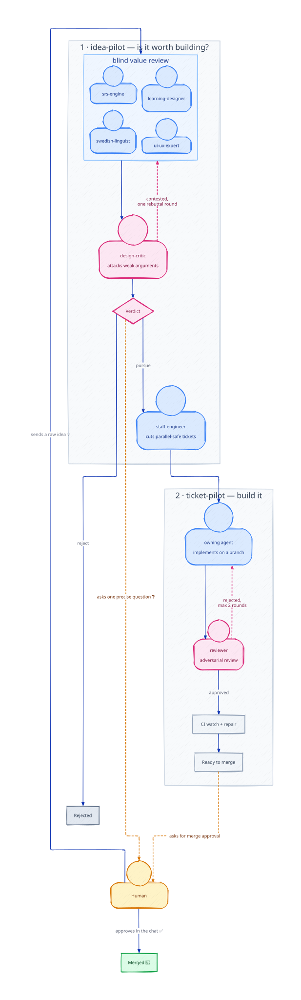

# How the AI team works

Ordböj is built by a team of Claude Code agents. The system runs on its
own: the pipelines review, test, and merge most changes without human
approval. The human answers only the rare questions that the pipelines
raise. This page describes the team, the rules that keep it safe, and the
automated pipelines that turn an idea into merged code. It also lists the
Claude Code features that make the setup work.

## The team

One Claude Code session acts as the team lead. The lead talks to the
human, splits the work, and dispatches it to specialist agents. Each
specialist is a Claude Code subagent with its own role description in
[`.claude/agents/`](../.claude/agents/).

| Agent               | Responsibility                                          |
| ------------------- | ------------------------------------------------------- |
| `product-manager`   | Scope, feature specs, and acceptance criteria           |
| `swedish-linguist`  | Verb data and the correctness of every Swedish form     |
| `srs-engine`        | The SM-2 scheduler, due dates, and progress storage     |
| `learning-designer` | Pedagogy decisions: session length, review mix, streaks |
| `staff-engineer`    | Architecture, app shell, and review of risky changes    |
| `frontend-expert`   | Pages, components, hooks, and styles                    |
| `devops`            | Build tooling, CI, dependencies, and releases           |
| `qa`                | Tests, regression coverage, and release sign-off        |
| `ui-ux-expert`      | Design audits in a real browser, with written findings  |
| `design-critic`     | Adversarial review of design proposals                  |

The specialists run in the background, in parallel, while the lead stays
responsive in the chat. The lead reports the results back to the human
when the work is done.

## Team rules

A few strict rules keep parallel agents from stepping on each other:

- **File ownership.** Each file belongs to one agent. An agent never
  edits a file that another agent owns. It reports the defect to the
  lead, and the lead routes it to the owner.
- **Evidence before "done".** The lead runs `lint`, `typecheck`, `test`,
  and `build`, and pastes the real output before it declares any work
  complete.
- **Domain decisions come first.** Pedagogy questions go to the
  learning designer, and scope questions go to the product manager,
  before any engineer writes code. Engineers do not invent product
  policy in the middle of a task.
- **Two facts shape every decision.** User progress lives only in one
  browser, so every storage change needs a version field and a
  migration. And a wrong Swedish form is worse than a missing one, so
  uncertain data goes to a human, never into the app.

## From idea to merged code

Three workflow scripts in [`.claude/workflows/`](../.claude/workflows/)
automate the path from a raw idea to a merged pull request. A workflow is
a JavaScript file that spawns many agents in a fixed order, with loops
and checks that code controls, not the model.

The diagram shows the full path as one circle. The human sits in the
center of the loop. Blue nodes are agents, pink nodes are adversarial
reviewers, and gray boxes are automatic steps. Dashed amber spokes are
the points where an agent stops and asks the human. The green edge at
the top closes the loop: a merged change makes room for the next idea.

The diagram is an SVG that the AI lead drew by hand, with no diagram
tool. To change it, edit [`diagrams/pipeline.svg`](diagrams/pipeline.svg)
directly.

### 1. `idea-pilot` — is the idea worth building?

The human sends a raw note, for example "what if the app had X?". The
pipeline then:

1. Splits the note into separate ideas.
2. Sends each idea to the three business owners (SRS, linguistics,
   pedagogy) and the UI/UX expert for a blind value review.
3. Lets the design critic attack weak arguments, with one bounded
   rebuttal round.
4. Produces a verdict per idea: pursue, reject, or ask the human one
   precise question.
5. For pursued ideas, has the staff engineer split the work into
   tickets with disjoint owners, so the tickets can run in parallel.

The pipeline ends with tickets on the board. It never writes code.

### 2. `ticket-pilot` — build it

The lead passes ticket numbers to this pipeline. For each ticket, it:

1. Triages the ticket and dispatches the owning agent to implement it
   on a branch.
2. Sends the diff to an adversarial reviewer. A rejection starts a
   remediation round on the same branch, with a maximum of two rounds.
3. Routes risky classes of change (storage schema, verb data, major
   version bumps) through an extra owner gate.
4. Watches CI on the pull request and repairs failures.
5. Stops at "ready to merge". Only the lead session merges. Most
   merges do not wait for the human. Only the rare cases in
   "What the human does" stop for an answer.

### 3. `deps-pilot` — keep dependencies current

This pipeline drains open Dependabot pull requests. Pure version bumps
with green CI merge on their own. Any update that needs a change to
application code goes to the human for approval first.

## Claude Code features we use

- **Subagents.** The specialist roles are custom agents with scoped
  tools. The lead dispatches them in the background and collects the
  results. This is how the team runs in parallel.
- **Workflows.** The three pipelines above orchestrate 8–40 agents per
  run with deterministic control flow.
- **Skills.** Project skills set the writing rules. One skill enforces
  Simplified Technical English for documents like this one. Another
  compresses chat output to save tokens.
- **Hooks.** A session-start hook loads the project defaults into every
  new session. A pre-tool hook filters shell commands.
- **CLAUDE.md.** The project memory file defines the team, the file
  ownership table, and the safety rules. Every session starts with it.
- **MCP servers.** The team tracks tasks in Linear and manages pull
  requests on GitHub through MCP tools.
- **PR activity subscriptions.** The lead subscribes to pull request
  events. CI failures and review comments wake the session, so there is
  no polling loop.
- **Cloud sessions.** Sessions run in isolated cloud containers, started
  from the web or from a phone.

## What the human does

The human sends ideas and answers the precise questions that the
pipelines raise. Most merges do not need human approval. The human
decides only the rare, risky cases and holds two hard vetoes: changes
to the `localStorage` schema and uncertain Swedish forms. Both stop the
pipeline until a person decides.

The agents work in the background, on their own schedule. Commits and
merges can appear at any hour of the day. This includes the maintainer's
normal work hours. The activity in this public repository shows the
agents at work, not the human.
